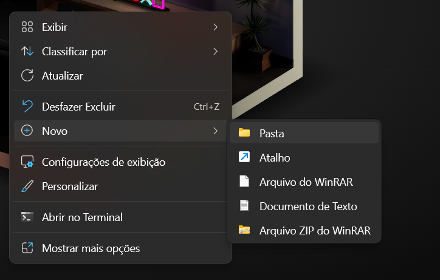
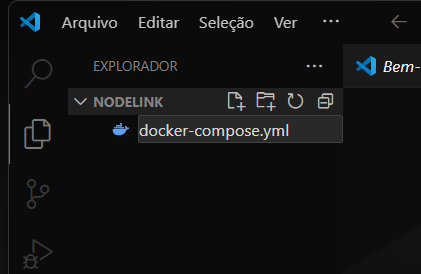
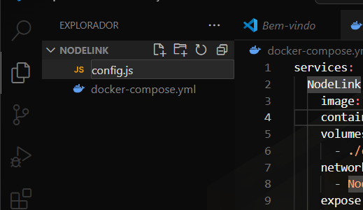
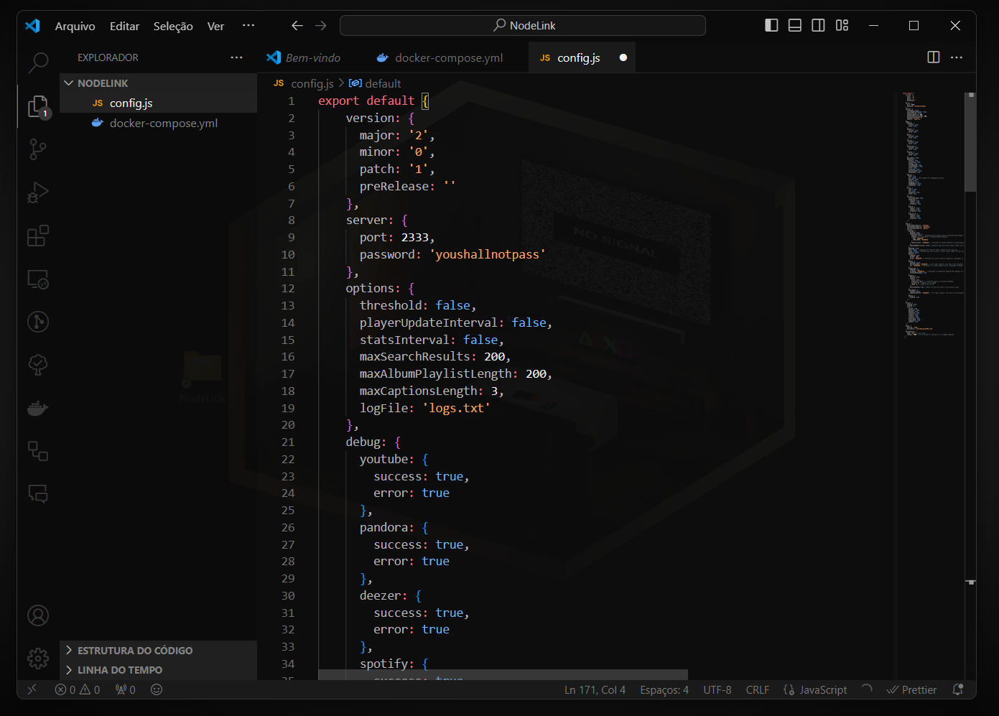
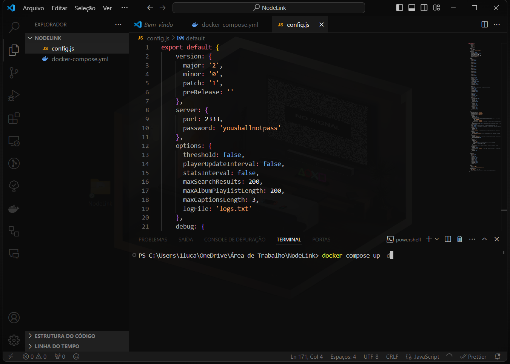
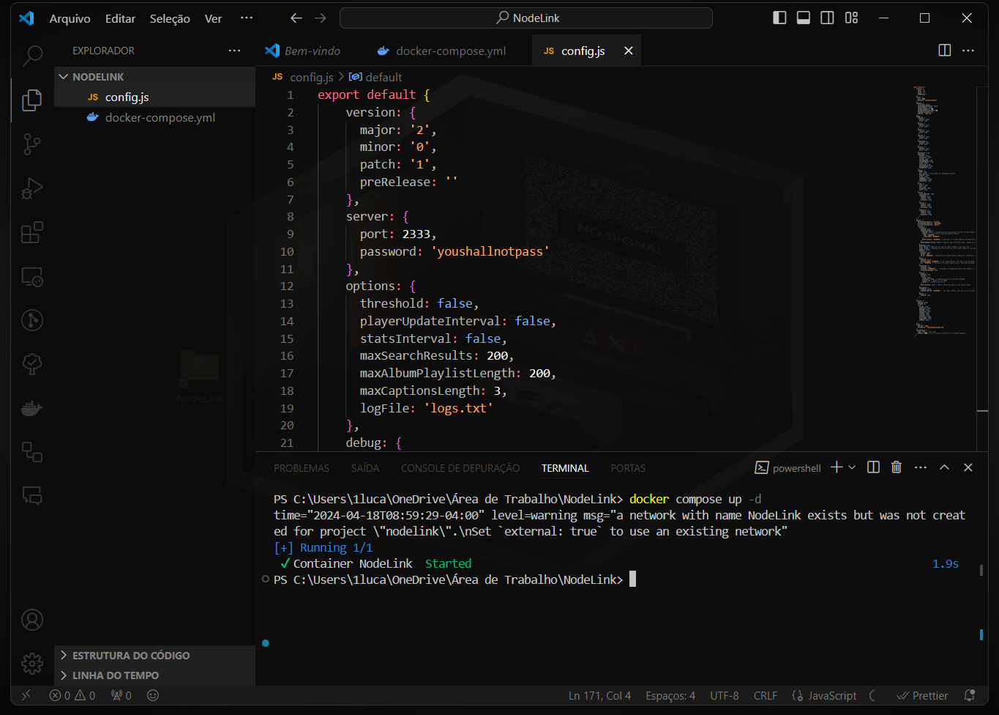

## Docker

Docker is an open source platform that simplifies the development, deployment and execution of applications through the use of containers. Containers are units of software that encapsulate the application and its dependencies, allowing it to run consistently and portably in different environments.

## Table of contents
1. [**Installing**](#installing)
   - [Installing Docker](#installing-docker)
   - [Installing NodeLink](#installing-nodelink)
      - [Installing with Docker Compose](#installing-with-docker-compose)
      - [Command-Line Installation](#command-line)

## Installing

This topic has information on how to install docker and how to use it with NodeLink.

### Installing Docker

For detailed instructions on installing the Docker Engine on various operating systems, including Linux, macOS and Windows, consult the official Docker documentation:

[Official Docker documentation](https://docs.docker.com/engine/install/)

we'll also need a docker tool called Docker Compose:

[Docker-Compose](https://docs.docker.com/compose/install/)

### Installing NodeLink

There are two ways to do this installation, the first is by showing a method to do it with the NodeLink configuration (config.js), the other is just with the command line.

#### Installing with Docker Compose

1. Create a folder wherever you want, inside this folder we'll create a file called `docker-compose.yml`




2. Once it's done, copy and paste this configuration:

```yml
services:
  NodeLink:
    image: performanc/nodelink:latest
    container_name: NodeLink
    volumes:
      - ./config.js:/usr/src/app/config.js
    networks:
      - NodeLink
    expose:
      - 2333
    ports:
      - "2333:2333"
networks:
  NodeLink:
    name: NodeLink
```

where there is 2333, it is the port where docker will redirect the NodeLink API, change it to the port you want, for example `2333:5000` it will expose the API to localhost:5000


3. With this, create a file in the same folder called config.js, and copy and paste the NodeLink configuration code into this file.





4. Do whatever any change you wish in config.js such as modifying the password, adding source credentials or enabling sources. Finally open the terminal in the directory where these files are located and type the following command: 

```shell
# docker compose up -d`
``` 




That's it, now just set it up on a client and be happy.

#### Command-Line

An easier and quicker way is to use the Docker CLI:

```shell
docker run -d --name NodeLink -p 2333:2333 performanc/nodelink
```

This way it's not very easy to modify the configuration file, but in the files inside the container you can find them in `usr/src/app`

modifying the port where it exposes the NodeLink API is also the same as the first method `2333:5000` it will expose to localhost:5000

why is the first part still 2333:?
this indicates the internal docker port where the API is running, if you modify in config.js, you also need to modify this internal port for example, you put 4444 in config.js you will put like this `4444:4444`.
